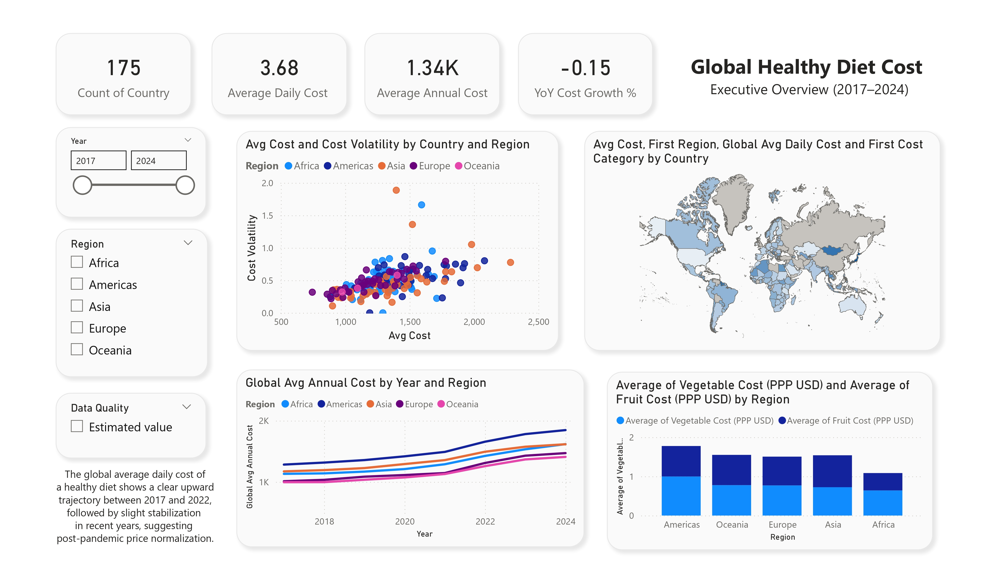
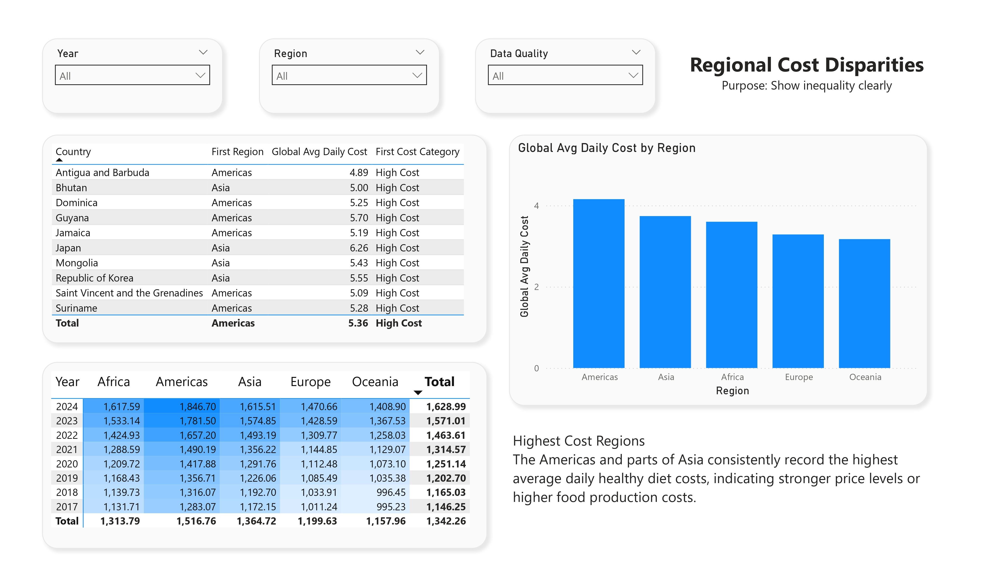
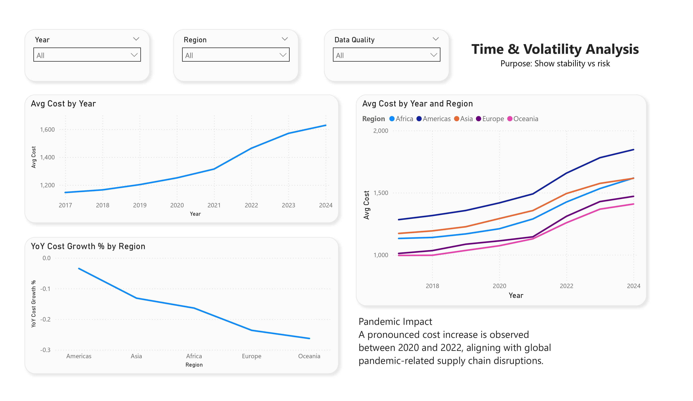

# 🌍 Global Healthy Diet Cost Analysis (2017–2024)

## 📌 Executive Summary
This project analyzes the global cost of a healthy diet across 170+ countries between 2017 and 2024 using FAO and World Bank data.

The objective is to assess affordability trends, regional disparities, volatility exposure, and diet component cost drivers that influence global food security and economic policy.

---

## 🎯 Business & Policy Objectives

- Evaluate global healthy diet cost trends over time
- Identify high-cost and high-volatility regions
- Measure structural shifts post-pandemic (2020–2022)
- Analyze the contribution of fruit and vegetable costs to total diet expenses
- Provide policy-relevant affordability insights

---

## 🛠 Tools & Technologies

- **Power BI** – Data modeling, DAX measures, dashboard design
- **Excel** – Data cleaning & preprocessing
- **DAX** – Calculated measures (YoY Growth, Volatility, Averages)
- **Data Visualization & Storytelling**

---

## 📊 Key Analytical Insights

- Healthy diet costs increased sharply between 2020–2022, reflecting global supply chain disruptions.
- Post-2022 stabilization does not indicate improved affordability — cost levels remain structurally elevated.
- The Americas and Asia consistently record higher average diet costs.
- Volatility patterns suggest varying exposure to global economic shocks.
- Fruit pricing contributes disproportionately to total cost fluctuations.

---

## 📸 Dashboard Preview

### Executive Overview

### Regional Cost Disparities

### Time & Volatility Analysis

### Diet Component Breakdown

---

## 📂 Repository Structure

